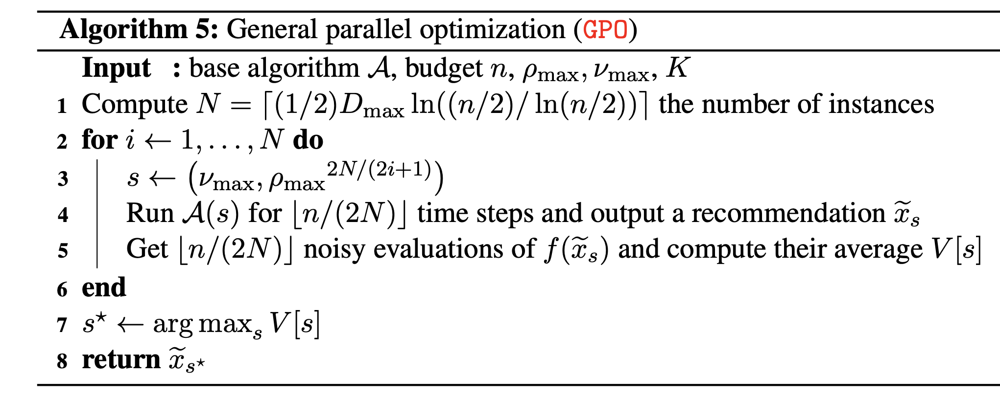

GPO
========

Introduction
------------
`paper <https://proceedings.mlr.press/v98/xuedong19a.html>`_,
`code <https://github.com/WilliamLwj/PyXAB/blob/main/PyXAB/algos/GPO.py>`_

**Title:** General parallel optimization a without metric

**Authors:** Xuedong Shang, Emilie Kaufmann, Michal Valko

**Abstract:** Hierarchical bandits are an approach for global optimization of \emph{extremely} irregular functions.
This paper provides new elements regarding POO, an adaptive meta-algorithm that does not require the knowledge of local
smoothness of the target function. We first highlight the fact that the subroutine algorithm used in POO should have a
small regret under the assumption of \emph{local smoothness with respect to the chosen partitioning}, which is unknown
if it is satisfied by the standard subroutine HOO. In this work, we establish such regret guarantee for HCT, which is
another hierarchical optimistic optimization algorithm that needs to know the smoothness. This confirms the validity of
POO. We show that POO can be used with HCT as a subroutine with a regret upper bound that matches the one of best-known
algorithms using the knowledge of smoothness up to a log n factor. On top of that, we further propose a more general
wrapper, called GPO, that can cope with algorithms that only have simple regret guarantees.

Algorithm Parameters
--------------------
    * numax (float) – parameter nu_max in the algorithm
    * rhomax (float) – parameter rho_max in the algorithm, the maximum rho used
    * rounds (int) – the number of rounds/budget
    * domain (list(list)) – the domain of the objective function
    * partition – the partition used in the optimization process. Default: BinaryPartition
    * algo – the baseline algorithm used by the wrapper, such as T_HOO or HCT

Usage Example
-------------

.. note::

    Make sure to use `get_last_point()` to get the final output

.. code-block:: python3

    from PyXAB.synthetic_obj.Garland import Garland
    from PyXAB.algos.GPO import GPO
    from PyXAB.algos.HOO import T_HOO

    domain = [[0, 1]]               # Parameter is 1-D and between 0 and 1
    target = Garland()
    rounds = 1000
    algo = GPO(rounds=rounds, domain=domain, algo=T_HOO)

    for t in range(rounds):
        point = algo.pull(t)
        reward = target(point)
        algo.receive_reward(t, reward)

    algo.get_last_point()