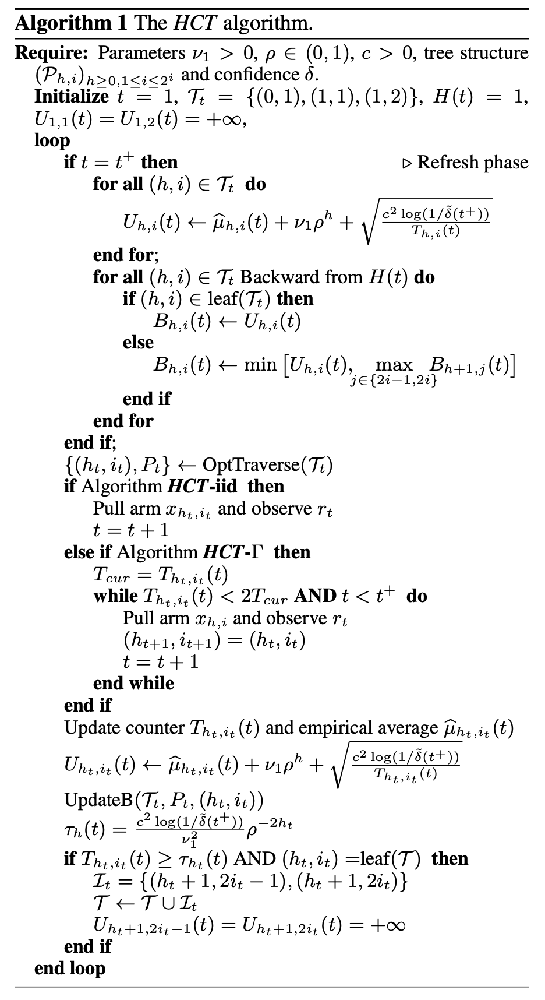

HCT
========

Introduction
------------
`paper <https://proceedings.mlr.press/v32/azar14.html>`_,
`code <https://github.com/WilliamLwj/PyXAB/blob/main/PyXAB/algos/HCT.py>`_

**Title:** Online Stochastic Optimization under Correlated Bandit Feedback

**Authors:** Mohammad Gheshlaghi Azar, Alessandro Lazaric, Emma Brunskill

**Abstract:** In this paper we consider the problem of online stochastic optimization of a locally smooth function
under bandit feedback. We introduce the high-confidence tree (HCT) algorithm, a novel anytime X-armed bandit algorithm,
and derive regret bounds matching the performance of state- of-the-art algorithms in terms of the dependency on number
of steps and the near-optimality dimension. The main advantage of HCT is that it handles the challenging case of
correlated bandit feedback (reward), whereas existing methods require rewards to be conditionally independent.
HCT also improves on the state-of-the-art in terms of the memory requirement, as well as requiring a weaker smoothness
assumption on the mean-reward function in comparison with the existing anytime algorithms. Finally, we discuss how HCT
can be applied to the problem of policy search in reinforcement learning and we report preliminary empirical results.

Algorithm Parameters
--------------------
    * `nu (float)` – parameter nu of the VHCT algorithm
    * `rho (float)` – parameter rho of the VHCT algorithm
    * `c (float)` – parameter c of the VHCT algorithm
    * `delta (float)` – confidence parameter delta of the VHCT algorithm
    * `domain (list(list))` – The domain of the objective to be optimized
    * `partition` – The partition choice of the algorithm. Default: BinaryPartition.

Usage Example
-------------
.. code-block:: python3

    from PyXAB.synthetic_obj.Garland import Garland
    from PyXAB.algos.HCT import HCT

    domain = [[0, 1]]               # Parameter is 1-D and between 0 and 1
    target = Garland()
    algo = HCT(domain=domain)

    for t in range(1000):
        point = algo.pull(t)
        reward = target(point)
        algo.receive_reward(t, reward)