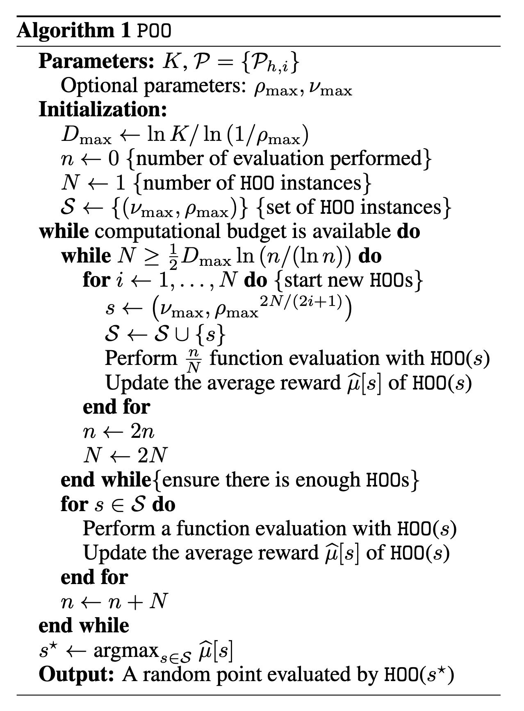

POO
========

Introduction
------------
`paper <https://proceedings.neurips.cc/paper/2011/file/7e889fb76e0e07c11733550f2a6c7a5a-Paper.pdf>`_,
`code <https://github.com/WilliamLwj/PyXAB/blob/main/PyXAB/algos/POO.py>`_

**Title:** Black-box optimization of noisy functions with unknown smoothness

**Authors:** Jean-Bastien Grill, Michael Valko, Remi Munos

**Abstract:** We study the problem of black-box optimization of a function f of any dimension, given function
evaluations perturbed by noise. The function is assumed to be locally smooth around one of its global optima,
but this smoothness is unknown. Our contribution is an adaptive optimization algorithm, POO or parallel optimistic
optimization, that is able to deal with this setting. POO performs almost as well as the best known algorithms
requiring the knowledge of the smoothness. Furthermore, POO works for a larger class of functions than what was
previously considered, especially for functions that are difficult to optimize, in a very precise sense. We provide a
finite-time analysis of POO’s performance, which shows that its error after n evaluations is at most a factor of √ln n
away from the error of the best known optimization algorithms using the knowledge of the smoothness.

.. note::

    Make sure to use `get_last_point()` to get the final output

Algorithm Parameters
--------------------
    * numax (float) – parameter nu_max in the algorithm
    * rhomax (float) – parameter rho_max in the algorithm, the maximum rho used
    * rounds (int) – the number of rounds/budget
    * domain (list(list)) – the domain of the objective function
    * partition – the partition used in the optimization process
    * algo – the baseline algorithm used by the wrapper, such as T_HOO or HCT

Usage Example
-------------

.. note::

    Make sure to use `get_last_point()` to get the final output

.. code-block:: python3

    from PyXAB.synthetic_obj.Garland import Garland
    from PyXAB.algos.POO import POO
    from PyXAB.algos.HOO import T_HOO

    domain = [[0, 1]]               # Parameter is 1-D and between 0 and 1
    target = Garland()
    rounds = 1000
    algo = POO(rounds=rounds, domain=domain, algo=T_HOO)

    for t in range(rounds):
        point = algo.pull(t)
        reward = target(point)
        algo.receive_reward(t, reward)

    algo.get_last_point()