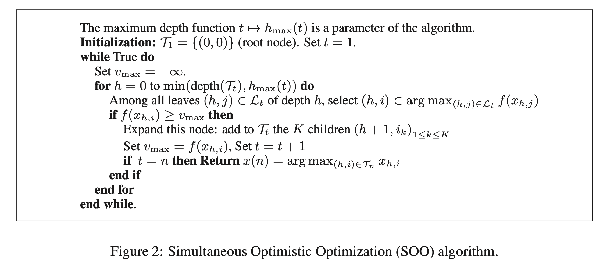

SOO
========

Introduction
------------
`paper <https://proceedings.neurips.cc/paper/2011/file/7e889fb76e0e07c11733550f2a6c7a5a-Paper.pdf>`_,
`code <https://github.com/WilliamLwj/PyXAB/blob/main/PyXAB/algos/SOO.py>`_

**Title:** Optimistic Optimization of a Deterministic Function without the Knowledge of its Smoothness

**Authors:** Remi Munos

**Abstract:** We consider a global optimization problem of a deterministic function f in a semi-metric space, given a
finite budget of n evaluations. The function f is assumed to be locally smooth (around one of its global maxima) with
respect to a semi-metric l. We describe two algorithms based on optimistic exploration that use a hierarchical
partitioning of the space at all scales. A first contribution is an algorithm, DOO, that requires the knowledge of l.
We report a finite-sample performance bound in terms of a measure of the quantity of near-optimal states. We then define
a second algorithm, SOO, which does not require the knowledge of the semi- metric l under which f is smooth, and whose
performance is almost as good as DOO optimally-fitted.

Algorithm Parameters
--------------------
    * `n (int)` – The total number of rounds (budget)
    * `h_max (int)` – The largest searching depth
    * `domain (list(list))` – The domain of the objective to be optimized
    * `partition` – The partition choice of the algorithm. Default: BinaryPartition.

Usage Example
-------------
.. code-block:: python3

    from PyXAB.synthetic_obj.Garland import Garland
    from PyXAB.algos.SOO import SOO

    domain = [[0, 1]]               # Parameter is 1-D and between 0 and 1
    target = Garland()
    algo = SOO(domain=domain)

    for t in range(1000):
        point = algo.pull(t)
        reward = target(point)
        algo.receive_reward(t, reward)