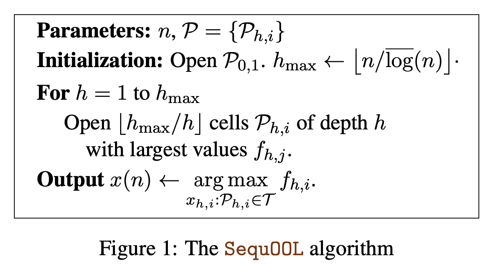

SequOOL
=========

Introduction
------------
`paper <https://arxiv.org/pdf/1810.00997.pdf>`_,
`code <https://github.com/WilliamLwj/PyXAB/blob/main/PyXAB/algos/StroquOOL.py>`_

**Title:** A simple parameter-free and adaptive approach to optimization under a minimal local smoothness assumption

**Authors:** Peter L. Bartlett, Victor Gabillon, Michal Valko

**Abstract:** We study the problem of optimizing a function under a budgeted number of evaluations. We only assume that
the function is locally smooth around one of its global optima. The difficulty of optimization is measured in terms
of 1) the amount of noise b of the function evaluation and 2) the local smoothness, d, of the function. A smaller d
results in smaller optimization error. We come with a new, simple, and parameter-free approach. First, for all values
of b and d, this approach recovers at least the state-of-the-art regret guarantees. Second, our approach additionally
obtains these results while being agnostic to the values of both b and d. This leads to the first algorithm that
naturally adapts to an unknown range of noise b and leads to significant improvements in a mod- erate and low-noise
regime. Third, our approach also obtains a remarkable improvement over the
state-of-the-art SOO algorithm when the noise is very low which includes the case of optimization under deterministic
feedback (b = 0). There, under our minimal local smoothness assumption, this improvement is of exponential magnitude
and holds for a class of functions that covers the vast ma- jority of functions that practitioners optimize (d = 0).
We show that our algorithmic improvement is borne out in experiments as we empirically show faster convergence on common
benchmarks.

Algorithm Parameters
--------------------
    * `n (int)` – The total number of rounds (budget)
    * `domain (list(list))` – The domain of the objective to be optimized
    * `partition` – The partition choice of the algorithm. Default: BinaryPartition.

Usage Example
-------------
.. note::

    Make sure to use `get_last_point()` to get the final output

.. code-block:: python3

    from PyXAB.synthetic_obj.Garland import Garland
    from PyXAB.algos.SequOOL import SequOOL

    domain = [[0, 1]]               # Parameter is 1-D and between 0 and 1
    target = Garland()
    rounds = 1000
    algo = SequOOL(n=rounds, domain=domain)

    for t in range(rounds):
        point = algo.pull(t)
        reward = target(point)
        algo.receive_reward(t, reward)

    algo.get_last_point()