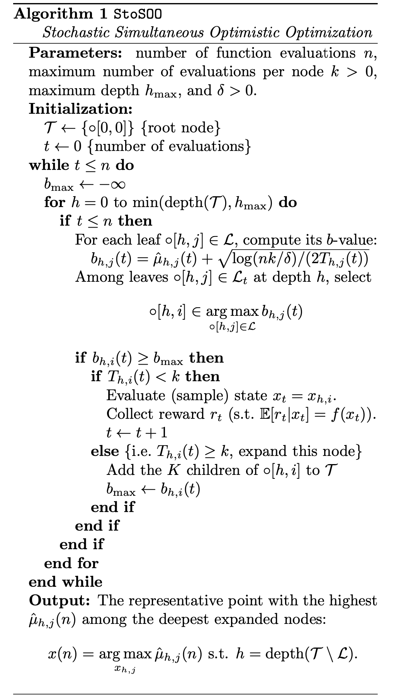

StoSOO
========

Introduction
------------
`paper <https://proceedings.mlr.press/v28/valko13.pdf>`_,
`code <https://github.com/WilliamLwj/PyXAB/blob/main/PyXAB/algos/StoSOO.py>`_

**Title:** Stochastic Simultaneous Optimistic Optimization

**Authors:** Michal Valko, Alexandra Carpentier, Remi Munos

**Abstract:** We study the problem of global maximization of a function f given a finite number of evaluations perturbed
by noise. We consider a very weak assumption on the function, namely that it is locally smooth (in some precise sense)
with respect to some semi-metric, around one of its global maxima. Compared to previous works on bandits in general
spaces (Kleinberg et al., 2008; Bubeck et al., 2011a) our algorithm does not require the knowledge of this semi-metric.
Our algorithm, StoSOO, follows an optimistic strategy to iteratively construct upper confidence bounds over the
hierarchical partitions of the function domain to decide which point to sample next. A finite-time analysis of
StoSOO shows that it performs almost as well as the best specifically-tuned algorithms even though the local smoothness
of the function is not known.

Algorithm Parameters
--------------------
    * `n (int)` – The total number of rounds (budget)
    * `k (int)` - The maximum number of pulls per node
    * `h_max (int)` – The largest searching depth
    * `delta (float)` - The confidence parameter delta
    * `domain (list(list))` – The domain of the objective to be optimized
    * `partition` – The partition choice of the algorithm. Default: BinaryPartition.

Usage Example
-------------
.. code-block:: python3

    from PyXAB.synthetic_obj.Garland import Garland
    from PyXAB.algos.StoSOO import StoSOO

    domain = [[0, 1]]               # Parameter is 1-D and between 0 and 1
    target = Garland()
    algo = StoSOO(domain=domain)

    for t in range(1000):
        point = algo.pull(t)
        reward = target(point)
        algo.receive_reward(t, reward)