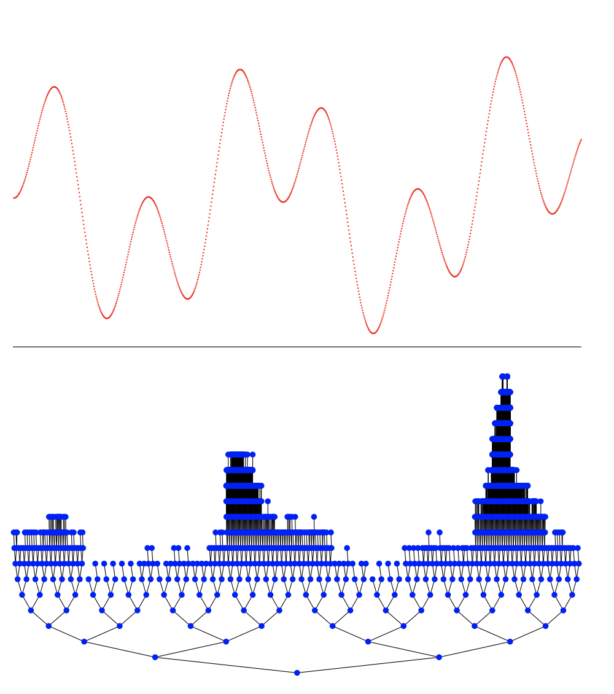

T-HOO
========

Introduction
------------
`paper <https://jmlr.org/papers/v12/bubeck11a.html>`_,
`code <https://github.com/WilliamLwj/PyXAB/blob/main/PyXAB/algos/HOO.py>`_

**Title:** X -Armed Bandits

**Authors:** Sebastien Bubeck, Remi Munos, Gilles Stoltz, Csaba Szepesvari

**Abstract:** We consider a generalization of stochastic bandits where the set of arms, X, is allowed to be a generic
measurable space and the mean-payoff function is “locally Lipschitz” with respect to a dissimilarity function that is
known to the decision maker. Under this condition we construct an arm selection policy, called HOO (hierarchical
optimistic optimization), with improved regret bounds compared to previous results for a large class of problems.
In particular, our results imply that if X is the unit hypercube in a Euclidean space and the mean-payoff function
has a finite number of global maxima around which the behavior of the function is locally continuous with a known
smoothness degree, then the expected regret of HOO is bounded up to a logarithmic factor by n, that is, the rate of
growth of the regret is independent of the dimension of the space. We also prove the minimax optimality of our algorithm
when the dissimilarity is a metric. Our basic strategy has quadratic computational complexity as a function of the
number of time steps and does not rely on the doubling trick. We also introduce a modified strategy, which relies on
the doubling trick but runs in linearithmic time. Both results are improvements with respect to previous approaches.

Algorithm Parameters
--------------------
    * `nu (float)` – parameter nu of the T_HOO algorithm
    * `rho (float)` – parameter rho of the T_HOO algorithm
    * `rounds (int)` - total number of rounds
    * `domain (list(list))` – The domain of the objective to be optimized
    * `partition` – The partition choice of the algorithm. Default: BinaryPartition.

Usage Example
-------------
.. code-block:: python3

    from PyXAB.synthetic_obj.Garland import Garland
    from PyXAB.algos.HOO import T_HOO

    domain = [[0, 1]]               # Parameter is 1-D and between 0 and 1
    target = Garland()
    rounds = 1000
    algo = T_HOO(rounds=rounds, domain=domain)

    for t in range(rounds):
        point = algo.pull(t)
        reward = target(point)
        algo.receive_reward(t, reward)