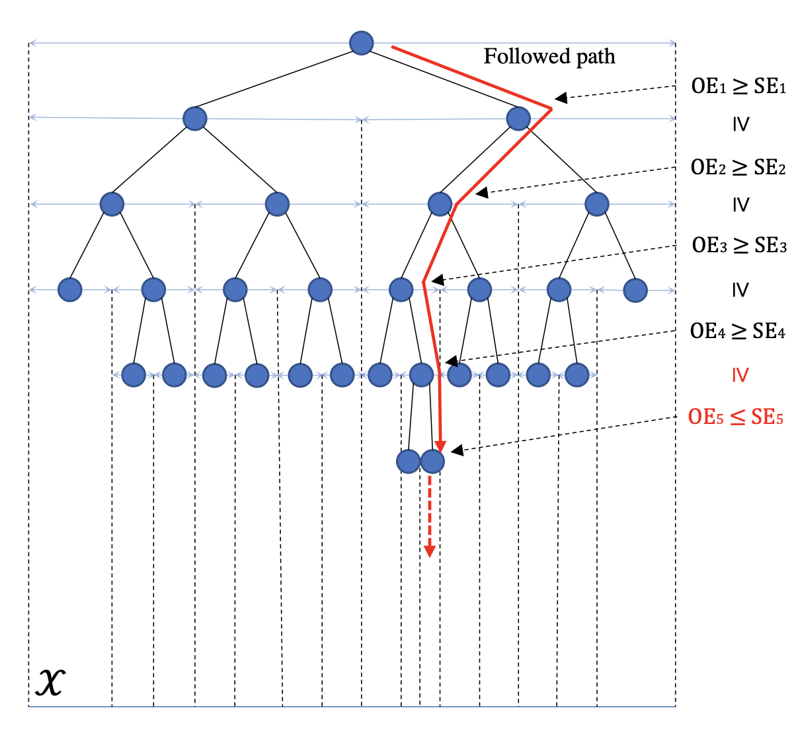

VHCT Algorithm
==============

Introduction
------------
`paper <https://openreview.net/forum?id=ClIcmwdlxn>`_,
`code <https://github.com/WilliamLwj/PyXAB/blob/main/PyXAB/algos/VHCT.py>`_

**Title:** Optimum-statistical Collaboration Towards General and Efficient Black-box Optimization

**Authors:** Wenjie Li, Chi-Hua Wang, Guang Cheng, Qifan Song

**Abstract:** In this paper, we make the key delineation on the roles of resolution and statistical
uncertainty in hierarchical bandits-based black-box optimization algorithms, guiding a more general analysis and
a more efficient algorithm design. We introduce the optimum-statistical collaboration, an algorithm framework of
managing the interaction between optimization error flux and statistical error flux evolving in the optimization
process. We provide a general analysis of this framework without specifying the forms of statistical error and
uncertainty quantifier. Our framework and its analysis, due to their generality, can be applied to a large family
of functions and partitions that satisfy different local smoothness assumptions and have different numbers of local
optimums, which is much richer than the class of functions studied in prior works. Our framework also inspires us to
propose a better measure of the statistical uncertainty and consequently a variance-adaptive algorithm VHCT. In theory,
we prove the algorithm enjoys rate-optimal regret bounds under different local smoothness assumptions; in experiments,
we show the algorithm outperforms prior efforts in different settings.

Algorithm Parameters
--------------------
    * `nu (float)` – parameter nu of the VHCT algorithm
    * `rho (float)` – parameter rho of the VHCT algorithm
    * `c (float)` – parameter c of the VHCT algorithm
    * `delta (float)` – confidence parameter delta of the VHCT algorithm
    * `bound (float)` – the noise upper bound parameter bound
    * `domain (list(list))` – The domain of the objective to be optimized
    * `partition` – The partition choice of the algorithm. Default: BinaryPartition.

Usage Example
-------------
.. code-block:: python3

    from PyXAB.synthetic_obj.Garland import Garland
    from PyXAB.algos.VHCT import VHCT

    domain = [[0, 1]]               # Parameter is 1-D and between 0 and 1
    target = Garland()
    algo = VHCT(domain=domain)

    for t in range(1000):
        point = algo.pull(t)
        reward = target(point)
        algo.receive_reward(t, reward)