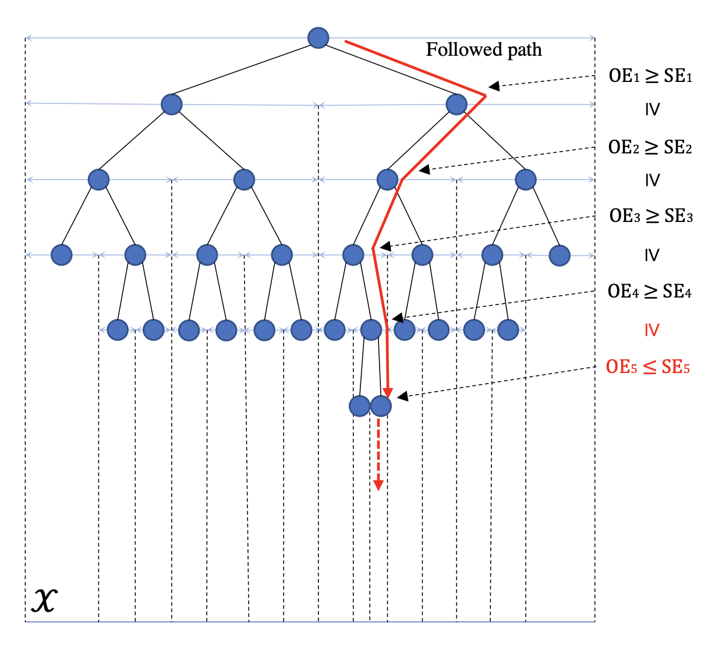

VPCT
========

Introduction
------------
`paper <https://openreview.net/forum?id=ClIcmwdlxn>`_,
`code <https://github.com/WilliamLwj/PyXAB/blob/main/PyXAB/algos/VPCT.py>`_

Algorithm Parameters
--------------------
    * `nu (float)` – parameter nu of the VHCT algorithm
    * `rho (float)` – parameter rho of the VHCT algorithm
    * `c (float)` – parameter c of the VHCT algorithm
    * `delta (float)` – confidence parameter delta of the VHCT algorithm
    * `bound (float)` – the noise upper bound parameter bound
    * `domain (list(list))` – The domain of the objective to be optimized
    * `partition` – The partition choice of the algorithm. Default: BinaryPartition.

Usage Example
-------------
.. code-block:: python3

    from PyXAB.synthetic_obj.Garland import Garland
    from PyXAB.algos.VPCT import VPCT

    domain = [[0, 1]]               # Parameter is 1-D and between 0 and 1
    target = Garland()
    algo = VHCT(domain=domain)

    for t in range(1000):
        point = algo.pull(t)
        reward = target(point)
        algo.receive_reward(t, reward)