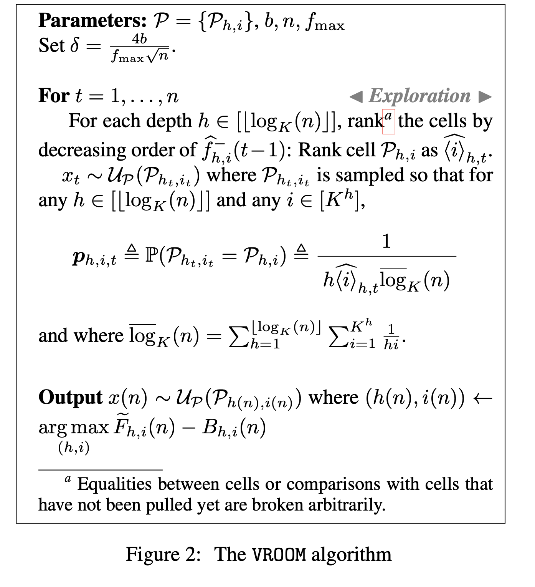

VROOM Algorithm
===============

Introduction
------------
`paper <https://proceedings.mlr.press/v108/ammar20a/ammar20a.pdf>`_, `code <https://github.com/WilliamLwj/PyXAB/blob/main/PyXAB/algos/VROOM.py>`_

**Title:** Derivative-Free & Order-Robust Optimisation

**Authors:** Victor Gabillon, Rasul Tutunov, Michal Valko, Haitham Bou Ammar

**Abstract:** In this paper, we formalise order-robust optimisation as an instance of online learning minimising simple regret,
and propose VROOM, a zeroth order optimisation algorithm capable of achieving vanishing regret in non-stationary
environments, while recovering favorable rates under stochastic reward-generating processes. Our results are the first
to target simple regret definitions in adversarial scenarios unveiling a challenge that has been rarely considered
in prior work.

Algorithm Parameters
--------------------
    * `n: int`- The total number of rounds (budget)
    * `h_max: int` - The maximum depth of the partition
    * `b: float` - The parameter that measures the variation of the function
    * `f_max: float` - An upper bound of the objective function
    * `domain: list(list)`- The domain of the objective to be optimized
    * `partition` - The partition choice of the algorithm

Usage Example
-------------

.. note::

    Make sure to use `get_last_point()` to get the final output

.. code-block:: python3

    from PyXAB.synthetic_obj.Garland import Garland
    from PyXAB.algos.VROOM import VROOM

    domain = [[0, 1]]               # Parameter is 1-D and between 0 and 1
    target = Garland()
    rounds = 1000
    algo = VROOM(n=rounds, b=1, domain=domain)

    for t in range(rounds):
        point = algo.pull(t)
        reward = target(point)
        algo.receive_reward(t, reward)

    algo.get_last_point()