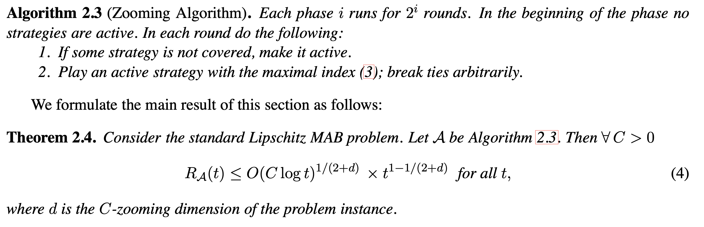

Zooming
========

Introduction
------------
`paper <https://arxiv.org/pdf/0809.4882.pdf>`_,
`code <https://github.com/WilliamLwj/PyXAB/blob/main/PyXAB/algos/Zooming.py>`_

**Title:** Multi-Armed Bandits in Metric Spaces

**Authors:** Robert Kleinberg, Aleksandrs Slivkins, Eli Upfal

**Abstract:**
In a multi-armed bandit problem, an online algorithm chooses from a set of strategies in a sequence of n trials so as to maximize the total payoff of the chosen strategies. While the performance of bandit al- gorithms with a small finite strategy set is quite well understood, bandit problems with large strategy sets are still a topic of very active investigation, motivated by practical applications such as online auctions and web advertisement. The goal of such research is to identify broad and natural classes of strategy sets and payoff functions which enable the design of efficient solutions.
In this work we study a very general setting for the multi-armed bandit problem in which the strate- gies form a metric space, and the payoff function satisfies a Lipschitz condition with respect to the metric. We refer to this problem as the Lipschitz MAB problem. We present a solution for the multi- armed problem in this setting. That is, for every metric space (L,X) we define an isometry invariant MaxMinCOV(X) which bounds from below the performance of Lipschitz MAB algorithms for X, and we
present an algorithm which comes arbitrarily close to meeting this bound. Furthermore, our technique gives even better results for benign payoff functions.

Algorithm Parameters
--------------------
    * `nu (float)` – parameter nu of the Zooming algorithm
    * `rho (float)` – parameter rho of the Zooming algorithm
    * `domain (list(list))` – The domain of the objective to be optimized
    * `partition` – The partition choice of the algorithm. Default: BinaryPartition.

Usage Example
-------------
.. code-block:: python3

    from PyXAB.synthetic_obj.Garland import Garland
    from PyXAB.algos.Zooming import Zooming

    domain = [[0, 1]]               # Parameter is 1-D and between 0 and 1
    target = Garland()
    algo = Zooming(domain=domain)

    for t in range(1000):
        point = algo.pull(t)
        reward = target(point)
        algo.receive_reward(t, reward)