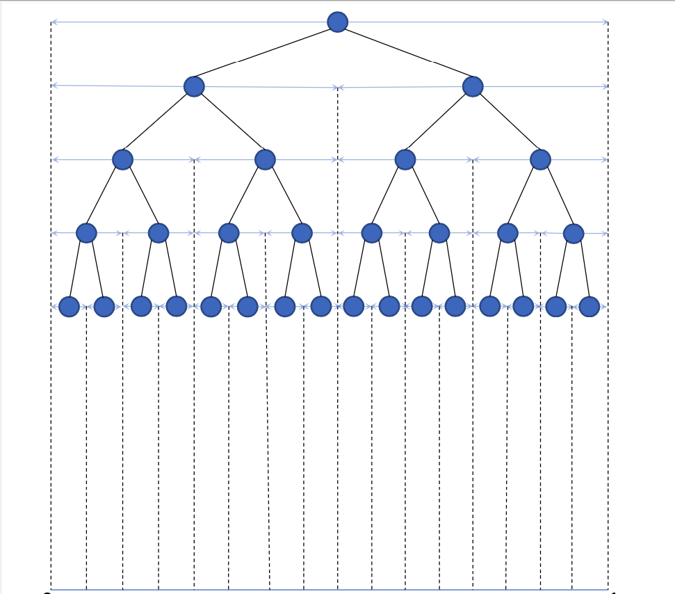

.. role:: raw-html-m2r(raw)
   :format: html

PyXAB - Python *X*\ -Armed Bandit
===================================

.. raw:: html

   

   
   
   
   
   

PyXAB is a Python open-source library for *X*\ -armed bandit, also known as continuous-arm bandit (CAB), Lipschitz bandit,
global optimization (GO) and bandit-based blackbox optimization problems.

PyXAB includes implementations of different algorithms for *X*\ -armed bandit, such as `HOO(Bubeck et al., 2011) <https://jmlr.org/papers/v12/bubeck11a.html>`_\ ,
`HCT(Azar et al., 2014) <https://proceedings.mlr.press/v32/azar14.html>`_\ , and the most
recent works `GPO(Shang et al., 2019) <https://proceedings.mlr.press/v98/xuedong19a.html>`_ and `VHCT(Li et al, 2021) <https://arxiv.org/abs/2106.09215>`_.
PyXAB also provides the most commonly-used synthetic objectives to evaluate the performance of different algorithms such as Garland and DoubleSine.

|pic1| |pic2|

.. |pic2| image:: ../../figs/HCT_visual.gif
   :width: 45%
   :alt: visualization

Quick Example
-------------

First define the blackbox objective, the parameter domain, the partition of the space, and the algorithm, e.g.

.. code-block:: python3

   target = Garland()
   domain = [[0, 1]]
   partition = BinaryPartition
   algo = T_HOO(rounds=1000, domain=domain, partition=partition)

At every round  ``t``\ , call ``algo.pull(t)`` to get a point. After receiving the (stochastic) reward for the point, call
``algo.receive_reward(t, reward)`` to give the algorithm the feedback

.. code-block:: python3

   point = algo.pull(t)
   reward = target.f(point) + np.random.uniform(-0.1, 0.1) # Uniform noise example
   algo.receive_reward(t, reward)

Citations
---------

If you use our package in your research or projects, we kindly ask you to cite our work

.. code-block:: text

   @article{li2021optimum,
     title={Optimum-statistical Collaboration Towards General and Efficient Black-box Optimization},
     author={Li, Wenjie and Wang, Chi-Hua, Qifan Song and Cheng, Guang},
     journal={arXiv preprint arXiv:2106.09215},
     year={2021}
   }

.. toctree::
   :maxdepth: 3
   :hidden:
   :caption: Getting Started

   getting_started/installation
   getting_started/jupyter

.. toctree::
   :maxdepth: 3
   :hidden:
   :caption: Features

   features/feat_algorithms
   features/feat_functions
   features/feat_partitions

.. toctree::
   :maxdepth: 3
   :hidden:
   :caption: API

   api/cheatsheet
   api/index

.. toctree::
   :maxdepth: 3
   :hidden:
   :caption: Additional Info

   info/team_members