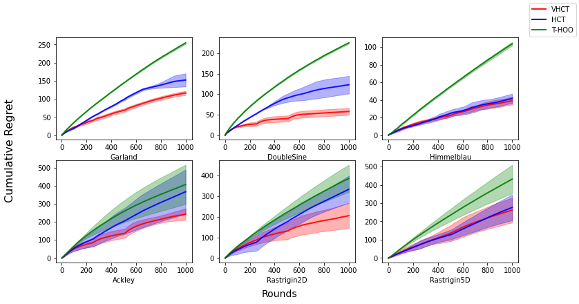
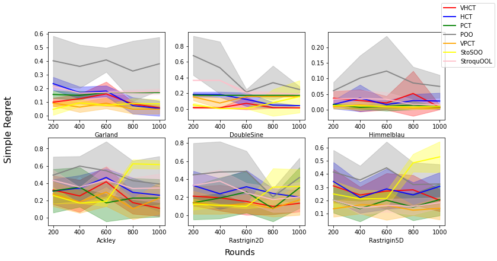
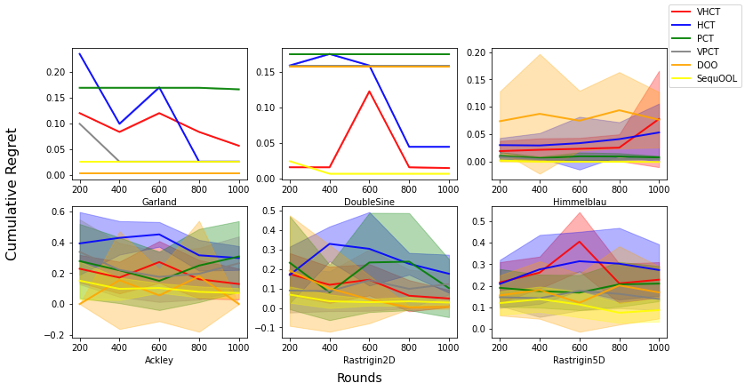

Leaderboard
===================================

We compare the performance of the existing algorithms on cumulative regret and simple regret minimization. Three settings
are compared. The cumulative regret minimization problem, the noisy simple regret minimization problem, and the noiseless
simple regret minimization problem.

Cumulative Regret (noisy)
-------------------------------

Best- VHCT, `reference1 <https://raw.githubusercontent.com/WilliamLwj/PyXAB/main/docs/jupyter_notebooks/cumulative_leaderboard.ipynb>`_

Simple Regret (noisy)
-------------------------------

Best- VHCT/VPCT/StoSOO `reference2 <https://raw.githubusercontent.com/WilliamLwj/PyXAB/main/docs/jupyter_notebooks/simple_leaderboard.ipynb>`_

Simple Regret (noiseless)
-------------------------------

Best- SequOOL `reference3 <https://raw.githubusercontent.com/WilliamLwj/PyXAB/main/docs/jupyter_notebooks/simple_leaderboard.ipynb>`_

