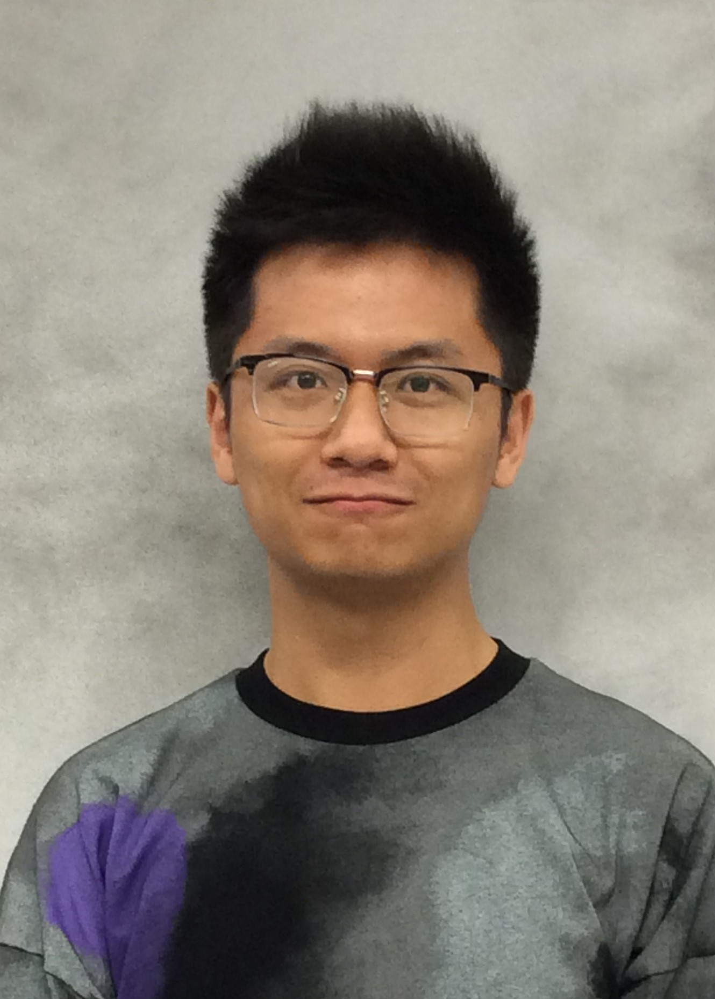
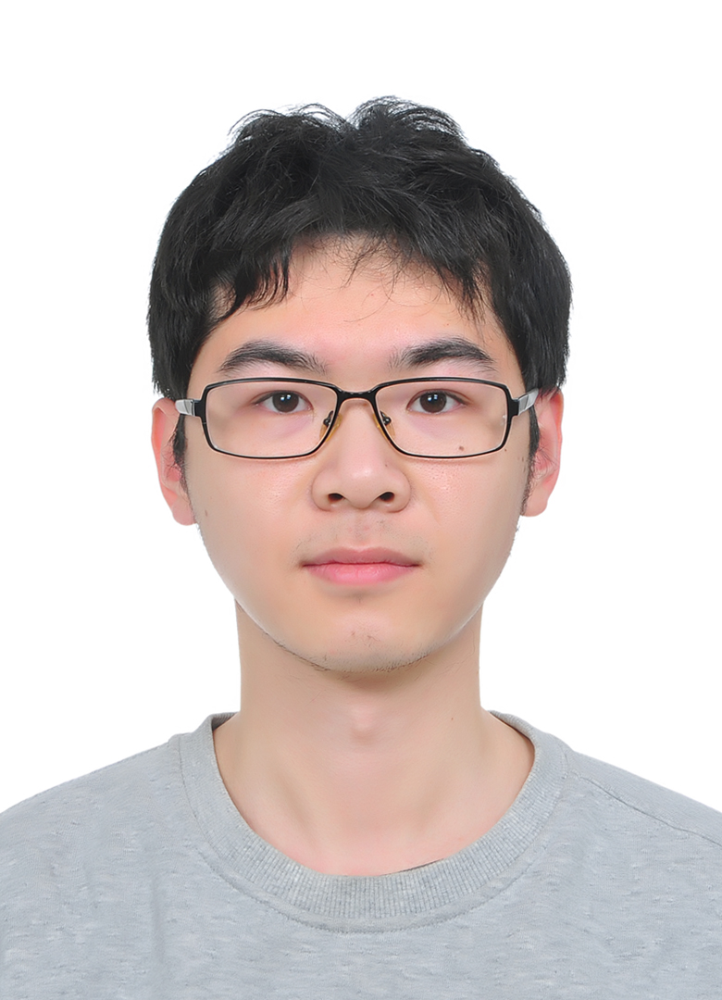

PyXAB Development Team
===================================

Coding
_______________

.. panels::

    |wenjie_photo|

    ---

    |wenjie|_ is a Ph.D. Candidate at Purdue University. |wenjie| has obtained an MS degree in Computer Science
    and Statistics during Ph.D. study. |wenjie| received a B.Sc. in Mathematics from Chinese University of Hong Kong, with double
    stream in Computational Applied Mathematics (CAM) and Enrichment Mathematics.

.. |wenjie| replace:: Mr. Wenjie Li
.. _wenjie: http://williamlwj.github.io/About/

.. panels::

    |haoze_photo|

    ---

    |haoze| is a Ph.D. Candidate at Purdue University. |haoze| received a B.Sc. in Statistics from Peking University

.. |haoze| replace:: Mr. Haoze Li

Advisory
________________

.. panels::

    |qifan_photo|

    ---

    |qifan|_ is  an Associate Professor at Purdue University. |qifan| obtained a doctoral degree in statistics
    from Texas A&M University in 2014 under the supervision of Dr. Faming Liang (who currently is a Distinguished Professor of Purdue University).
    Before that, |qifan| obtained a bachelor's degree in probability and statistics from Peking University, China in 2009.

.. |qifan_photo| image:: photos/qifan.jpg
   :width: 70%
   :alt: qifan
.. |qifan| replace:: Prof. Qifan Song
.. _qifan: https://www.stat.purdue.edu/~qfsong/

.. panels::

    |jean_photo|

    ---
    |jean|_ is an Assistant Professor at Purdue University. Prior to joining Purdue, |jean| was a postdoctoral associate at MIT CSAIL, working with Tommi Jaakkola

.. |jean_photo| image:: photos/jean.jpg
   :width: 70%
   :alt: jean
.. |jean| replace:: Prof. Jean Honorio
.. _jean: https://www.cs.purdue.edu/homes/jhonorio/

